# Application mock screens

High-fidelity desktop mocks for the three Module Federation apps. Matching interactive pages live in `frontend/` (static mock data, no backend).

## HR Shell (`hr-shell`)

| Screen | Route | File |
|--------|-------|------|
| SSO / company IdP | `/login` | [hr-shell-sso.png](hr-shell-sso.png) |
| Command center | `/` | [hr-shell-home.png](hr-shell-home.png) |

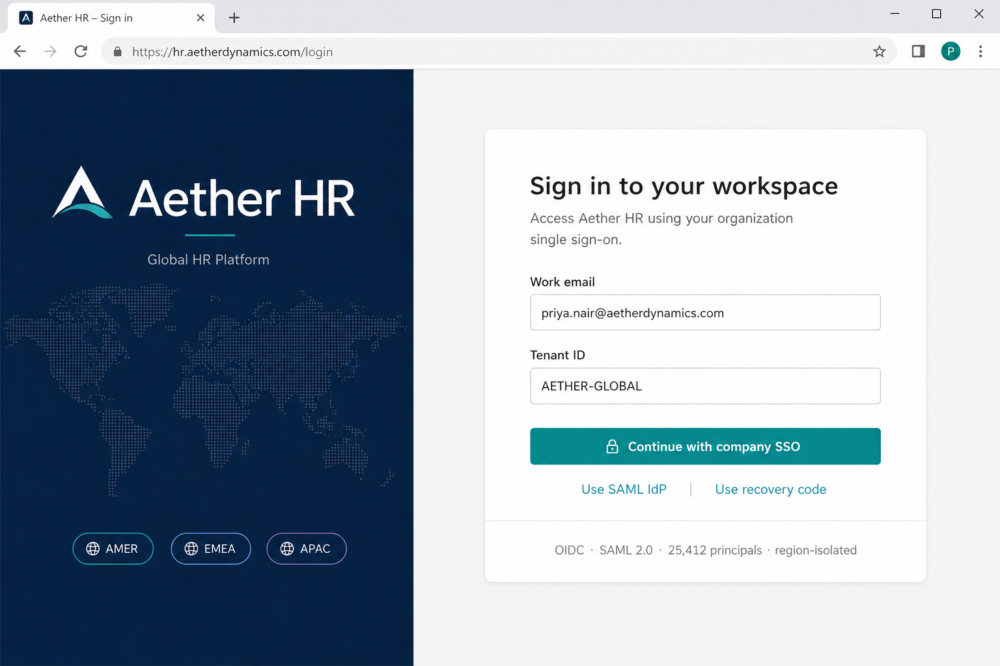

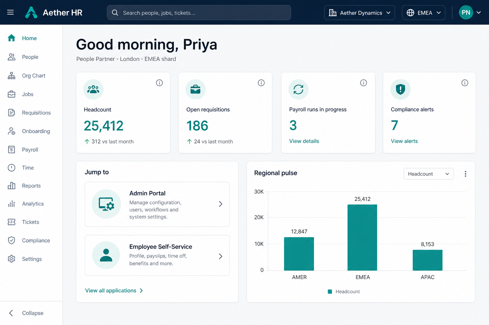

## Admin Portal (`admin-portal`)

| Screen | Route | File |
|--------|-------|------|
| Operations overview | `/admin` | [admin-dashboard.png](admin-dashboard.png) |
| Employee directory | `/admin/directory` | [admin-directory.png](admin-directory.png) |
| Org chart | `/admin/org` | [admin-org-chart.png](admin-org-chart.png) |
| Recruitment pipeline | `/admin/recruitment` | [admin-recruitment.png](admin-recruitment.png) |
| Payroll runs | `/admin/payroll` | [admin-payroll.png](admin-payroll.png) |
| Identity & access | `/admin/access` | [admin-iam.png](admin-iam.png) |

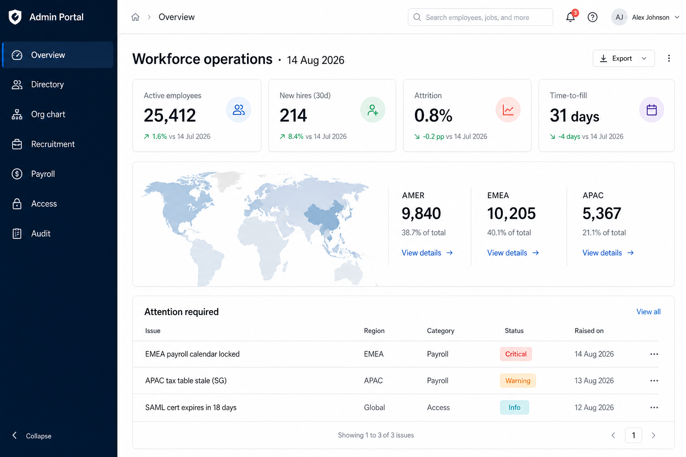

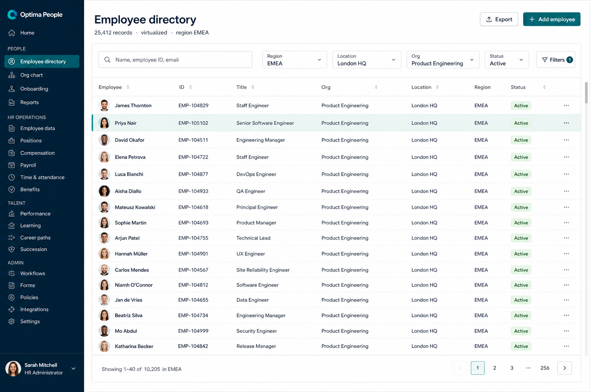

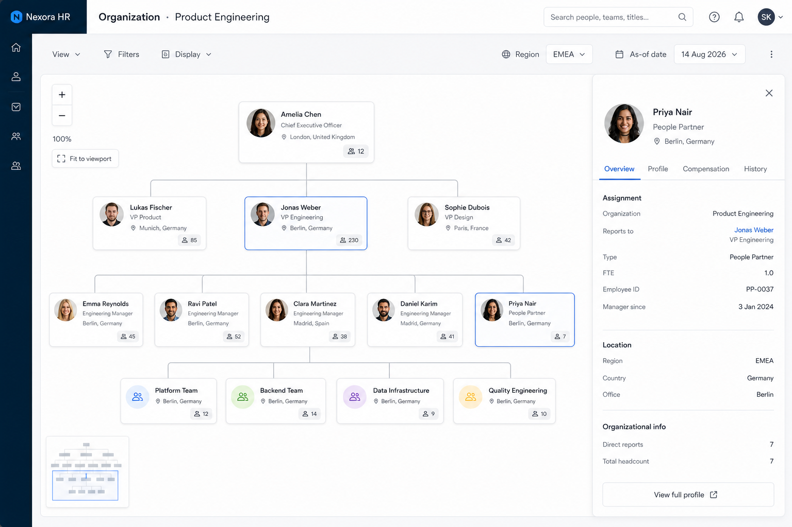

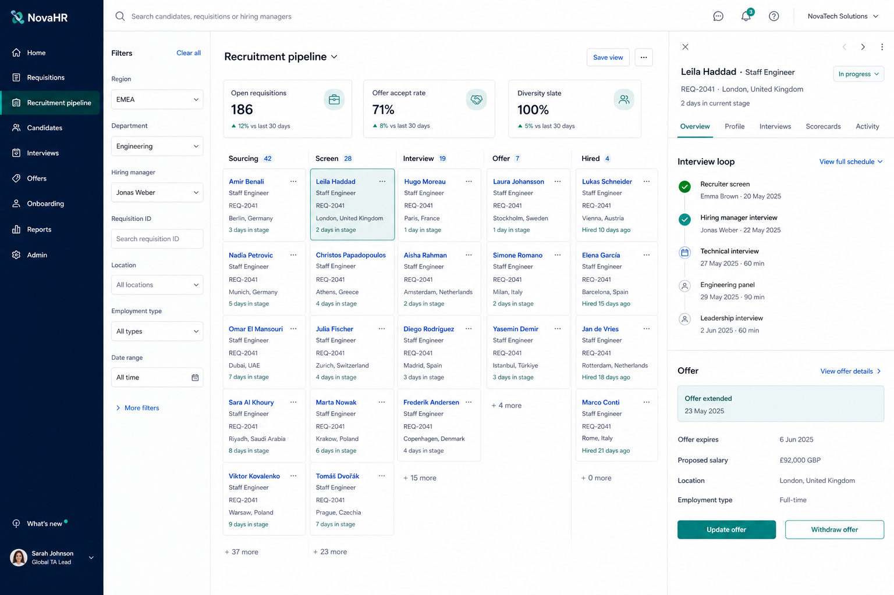

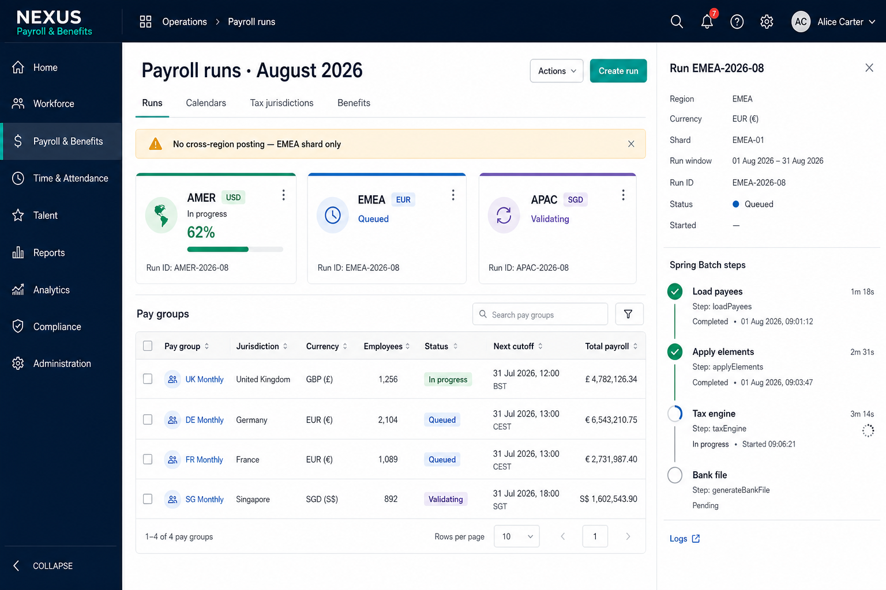

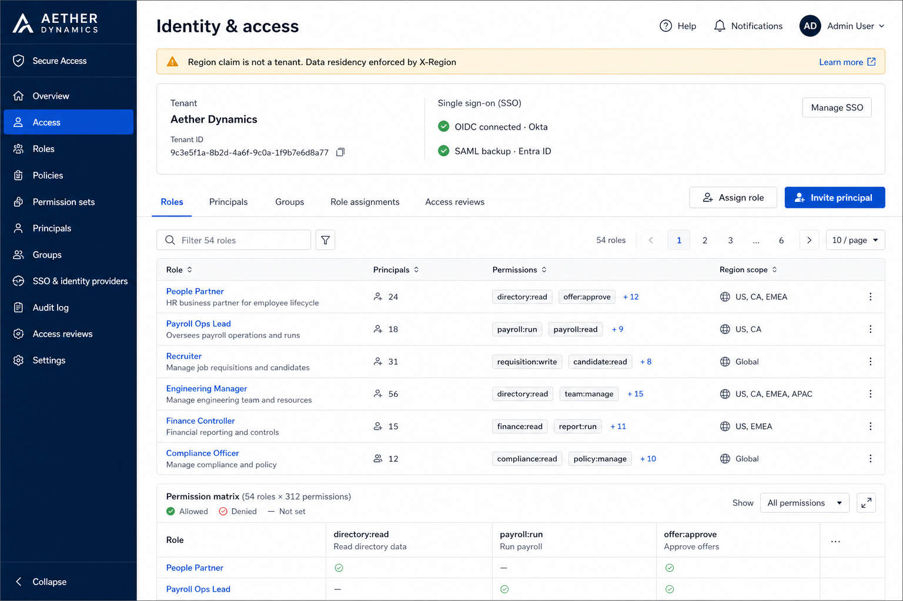

## Employee Self-Service (`employee-self-service`)

| Screen | Route | File |
|--------|-------|------|
| My workspace | `/ess` | [ess-workspace.png](ess-workspace.png) |
| Time off | `/ess/time-off` | [ess-time-off.png](ess-time-off.png) |
| Payslip | `/ess/payslips` | [ess-payslip.png](ess-payslip.png) |

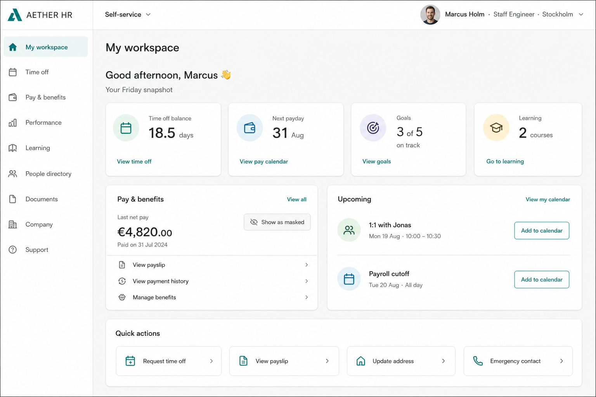

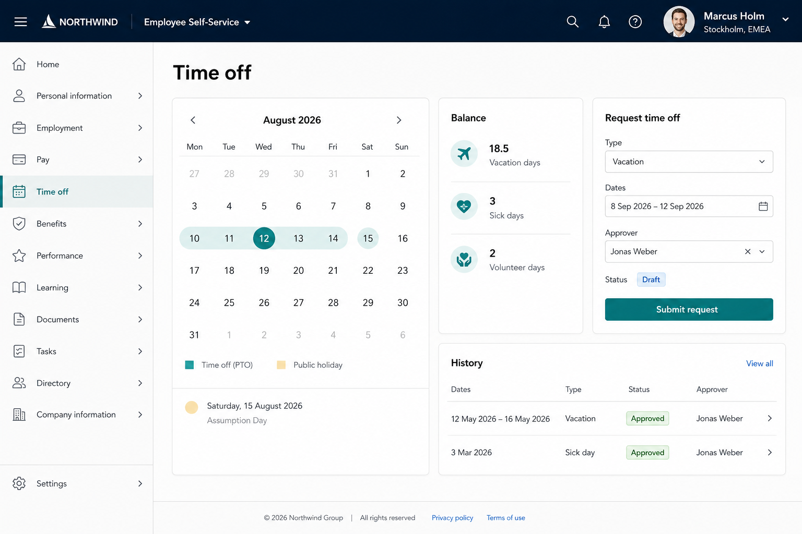

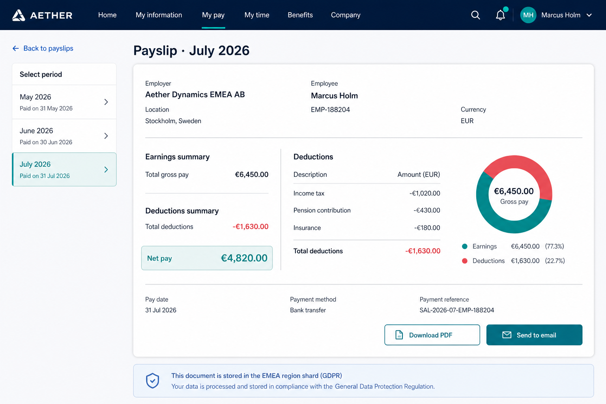

Persona: tenant **Aether Dynamics**, region **EMEA**, People Partner **Priya Nair**, employee **Marcus Holm**. All figures are mock.
